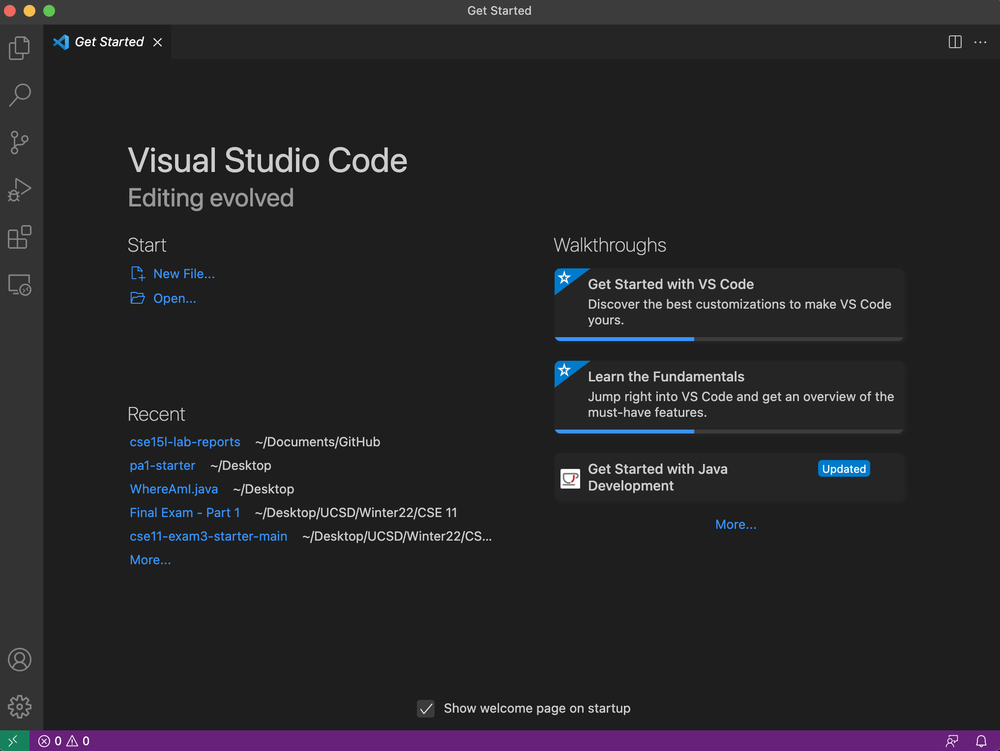
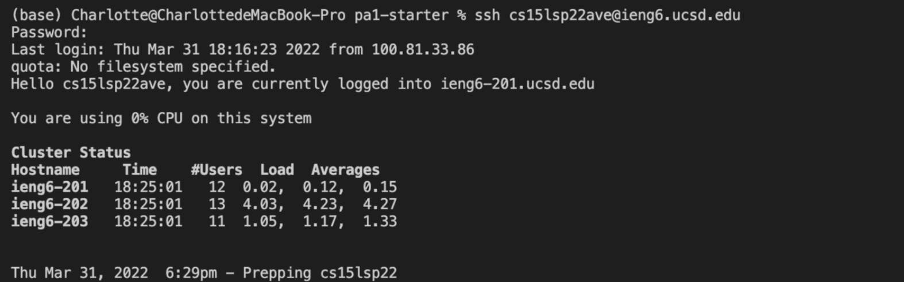
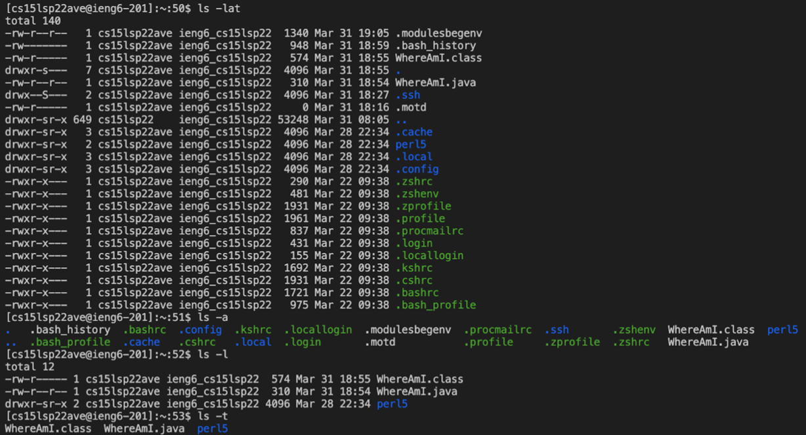
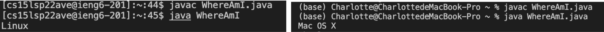
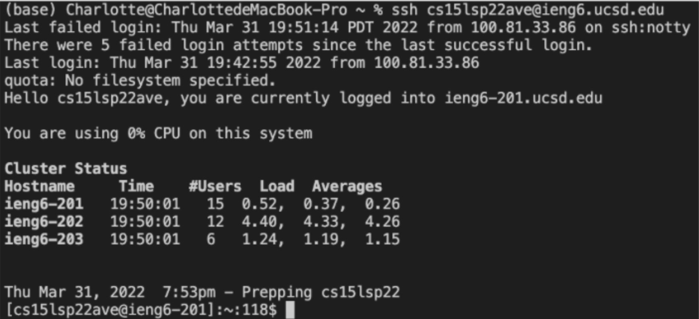
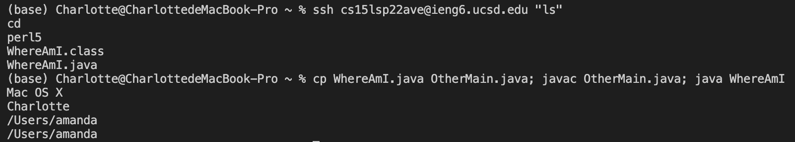

# Week 2 Lab Report

## 1. Installing VScode
Firstly，installing VScode from website [https://code.visualstudio.com/](https://code.visualstudio.com/). 


## 2. Remotely Connecting
Secondly, open a terminal in VSCode and enter the command (replacing `zz` with your own id): 
``` java
$ ssh cs15lsp22zz@ieng6.ucsd.edu
```


## 3. Trying Some Commands
Thirdly, try some commands in the terminal: 
* `cd ~`
* `cd`
* `ls`
* `ls -a`
* `ls -lat`
* `cp /home/linux/ieng6/cs15lsp22/public/hello.txt ~/`
* `cat /home/linux/ieng6/cs15lsp22/public/hello.txt`


## 4. Moving Files with `scp`
Create a file on your computer called `WhereAmI.java`, and run it from the _client_ by using `javac` and `java`, and then from the _terminal_ using the command:
```java
scp WhereAmI.java cs15lsp22zz@ieng6.ucsd.edu:~/
```


## 5. Setting an SSH Key
Now utilize the `ssh-keygen` program, where two files are created in this process: `id_rsa` to save the private password and `id_rsa.pub` to save the public password. Then `scp` the public key to the `.ssh` directory on the server.


## 6. Optimizing Remote Running
* You can write a command in quotes at the end of an ssh command to directly run it on the remote server, then exit. For example, this command will log in and list the home directory on the remote server:
```java
 $ ssh cs15lsp22zz@ieng6.ucsd.edu "ls"
```
* You can use semicolons to run multiple commands on the same line in most terminals. For example, try:
```java
 $ cp WhereAmI.java OtherMain.java; javac OtherMain.java; java WhereAmI
```
