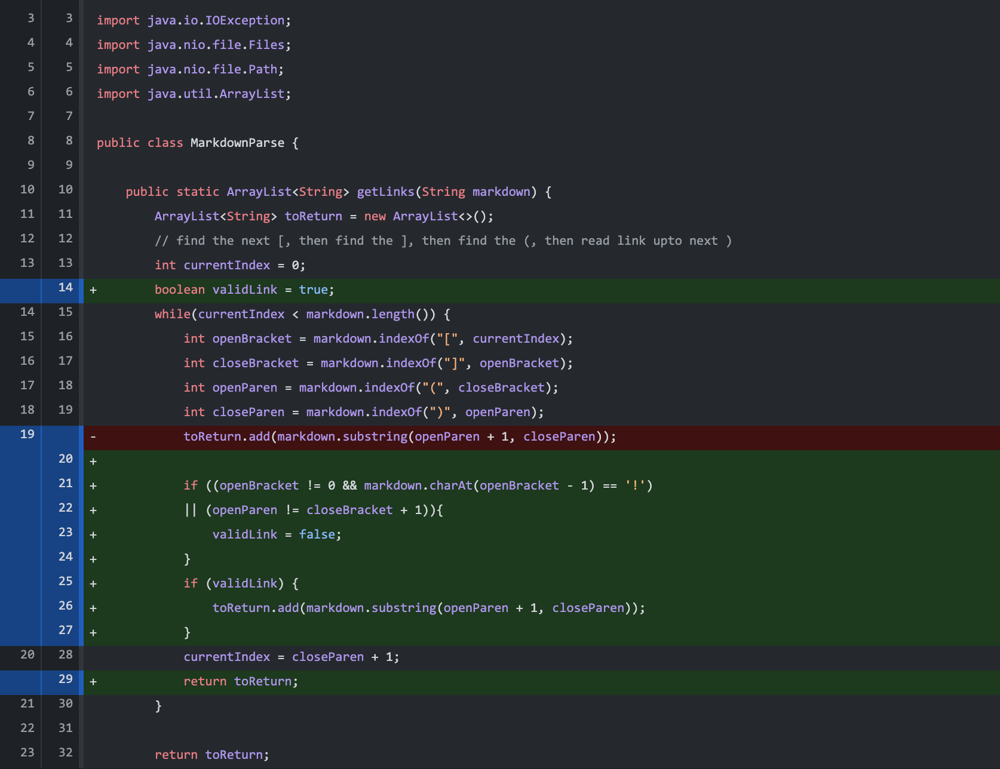
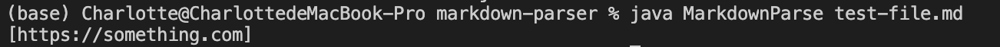
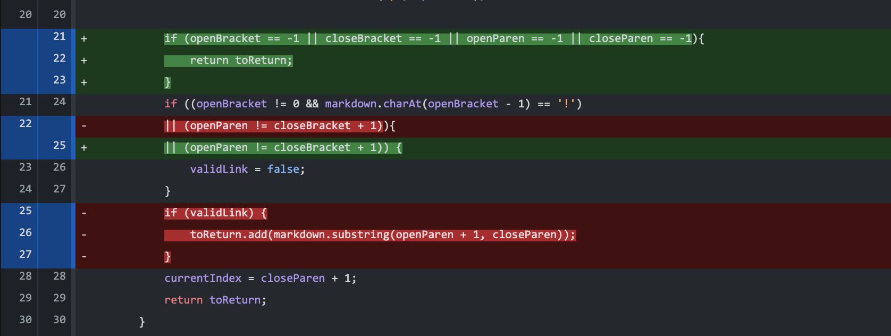
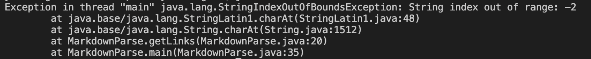
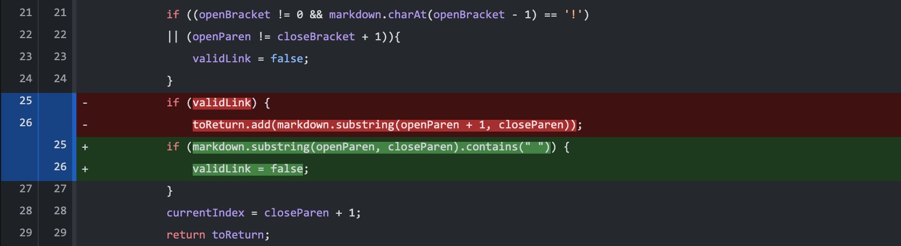
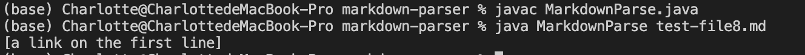

# Week 4 lab report: debug
# First code change
**Screenshot of the code change diff from Github**

**Link to the test file for a failure-inducing input that prompted you to make that change**
[test-file.md](https://github.com/CharlotQi/cse15l-lab-reports/blob/main/test-file.md)

**Symptom of that failure-inducing input**

**Write 2-3 sentences describing the relationship between the bug, the symptom, and the failure-inducing input**
The failure-inducing input(imageTest.md) only have two images. The symptom is that the terminal gave us the names that are inside the image formats, which were not wanted. The bug is that the code did not check for exclamation mark befoer the open bracket. Therefore, this bug triggered the symptom that's caused by the bug.

# Second code change
**Screenshot of the code change diff from Github**

**Link to the test file for a failure-inducing input that prompted you to make that change**
[noLinkFile.md](https://github.com/CharlotQi/cse15l-lab-reports/blob/main/noLinkFile.md)

**Symptom of that failure-inducing input**

**Write 2-3 sentences describing the relationship between the bug, the symptom, and the failure-inducing input**
The symptom is that java threw an IndexOutofBoundsException. The bug is that when variables are initiated with the indexOf method, if no bracket or parenthesis is find, they are set to -1. When it's used to check the "!", the index would be -1-1 = -2. The failure-inducing input has no valid link. Therefore, it triggers the symptom of StringIndexOutofBounds with -2, which was caused by the bug specified above.

# Third code change
**Screenshot of the code change diff from Github**

**Link to the test file for a failure-inducing input that prompted you to make that change**
[test-file8.md](https://github.com/CharlotQi/cse15l-lab-reports/blob/main/test-file8.md)

**Symptom of that failure-inducing input**

**Write 2-3 sentences describing the relationship between the bug, the symptom, and the failure-inducing input**
The symptom is that the terminal outputs the content inside the parenthesis even though it is not a valid link. The bug is that the code does not check if the content in the parenthesis. The failure-inducing input has the correct format but the wrong contents. Therefore, the failure-inducing input triggers the symptom that's caused by the bug in the code.
