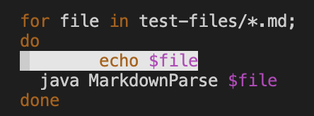
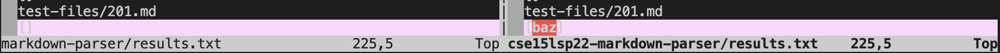
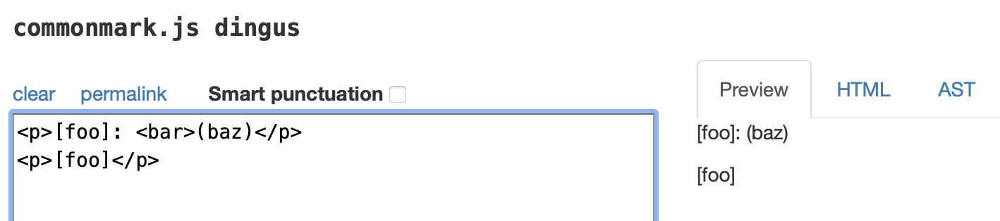
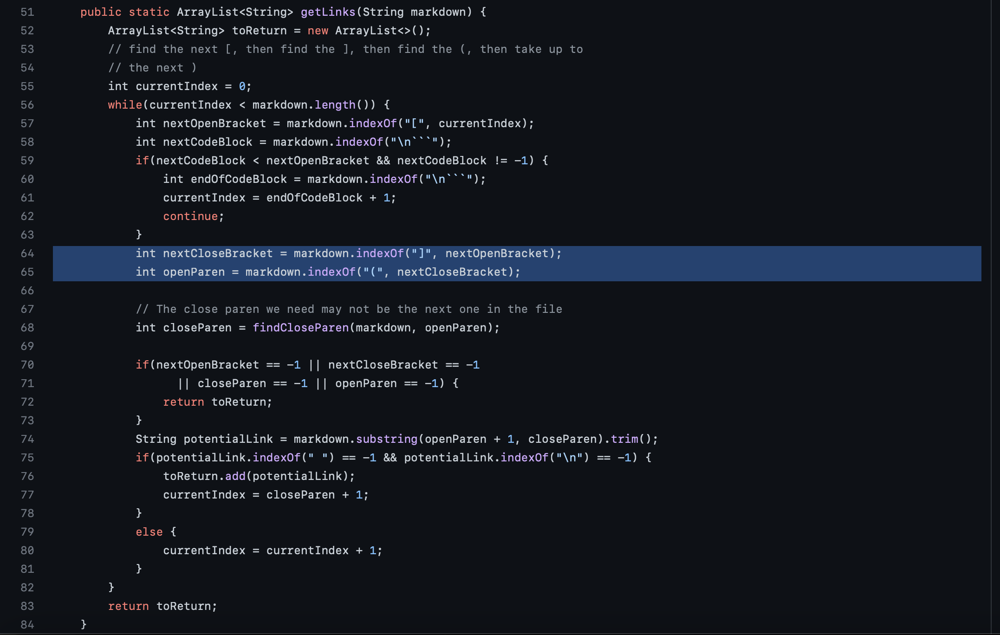
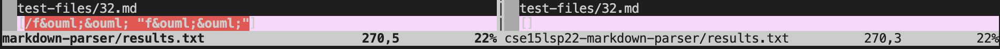
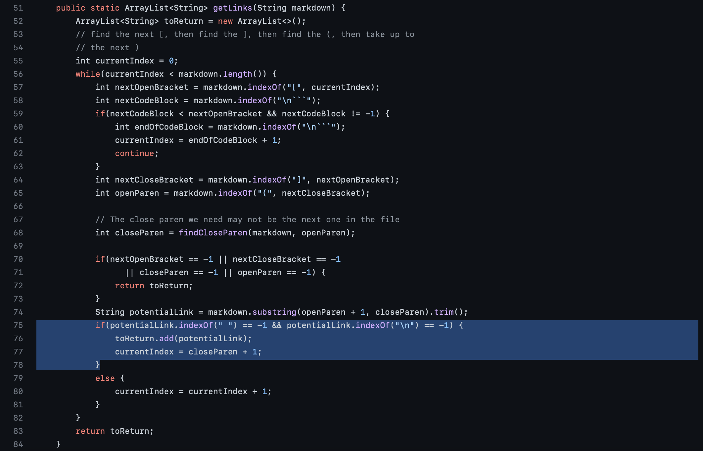
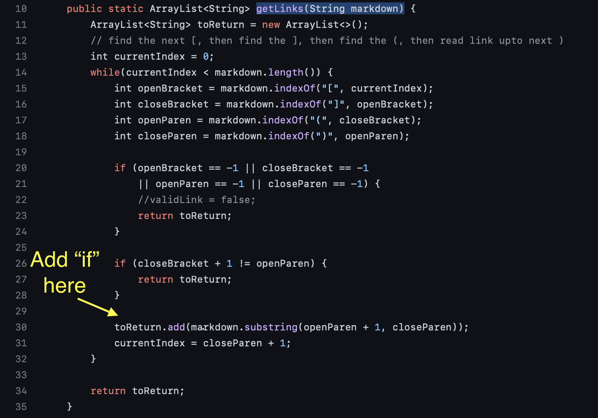

# Week-10-Lab-Report

Explanation: I have used `vimdiff` on the results of running `bash script.sh`. To make it easier to recognize hundreds of `.md` files, I added a line to the original `script.sh` file: 



After comparing different outputs, I used [CommonMarkdown Demo site](https://spec.commonmark.org/dingus/) to figure out the correct output. 

## Bug 1

[test-files/201.md](https://github.com/nidhidhamnani/markdown-parser/blob/main/test-files/201.md)

In this case, I found that there was a bug in the given implementation. 



The result on CommonMarkdown Demo site shows that the correct output should be [] since there's no valid link in the preview window. 



Expected links:
```java
[]
```

In this case, my implementation is correct but the implementation of markdonw-parse provided is wrong since its output of runnning 201.md is [baz] but it should be empty []; it is because that the codes between the close bracket `]` and the open parenthesis `(` , which is `: <bar>` , made `[foo]: <bar>(baz)` not a valid link. Based on the highlighted part of codes as follows, in this implementation, it would directly looks for the open parenthesis `(` and ignore whatever it is in the middle of `]` and `(`. 



## Bug 2

[test-files/32.md](https://github.com/nidhidhamnani/markdown-parser/blob/main/test-files/32.md)

In this case, I found that there was another bug in the given implementation. 



The result on CommonMarkdown Demo site shows that the correct output should be [] since there's no valid link in the preview window. 


Expected links:
```java
[/f&ouml;&ouml;]
```

In this case, both of the two implementations are wrong. 
1. For the provided implementation, it is because its output is empty but there should be a link. It is because that the codes highlighted below shows that any `potentialLink` including `" "` and `\n` are not passing the `if` statement here and therefore not being added to the `toReturn` ArrayList. So the whole link is not added and it returns an empty ArrayList. 



2. For my implementation, it is because that I did not write a method to test if part of the link is in the quotation marks. I should add an `if` statement to see if there are quotation marks in it and delete them and the contents between them. 


